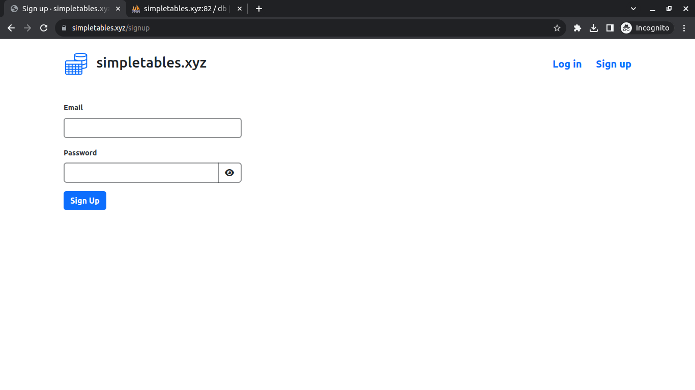
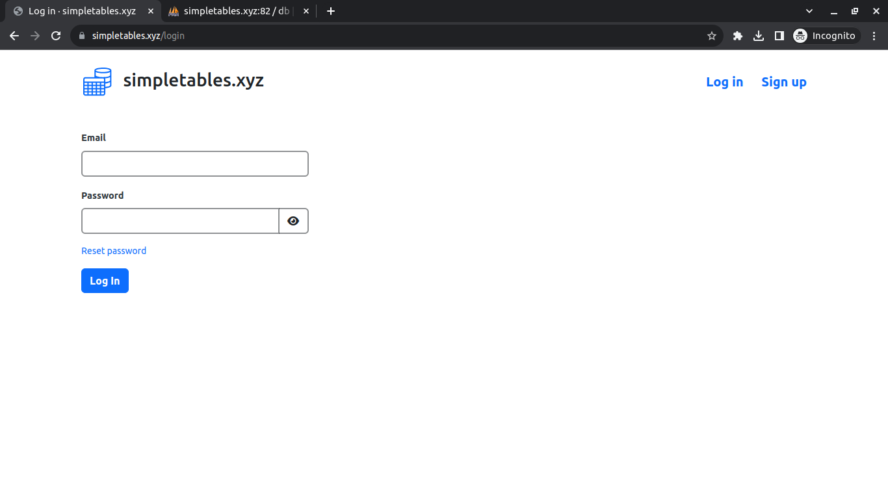
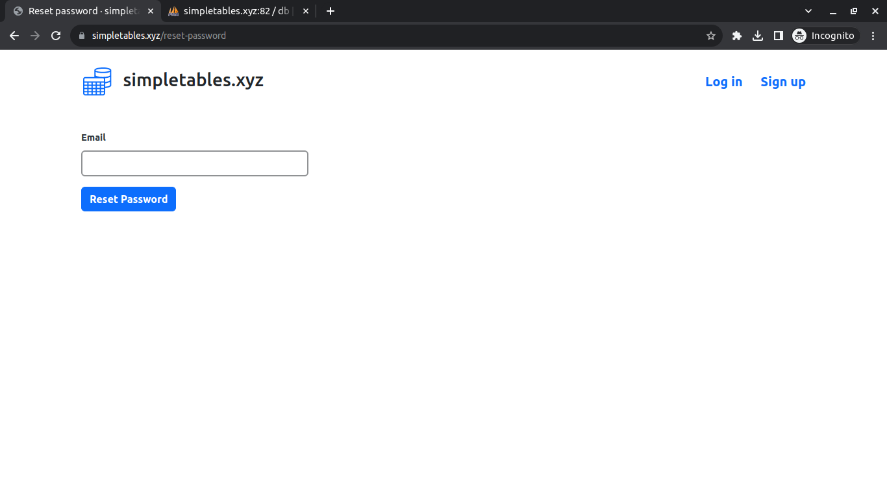
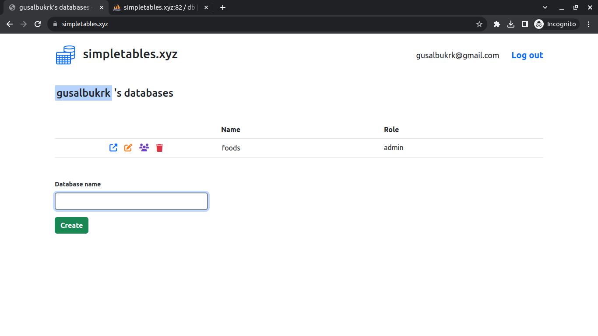
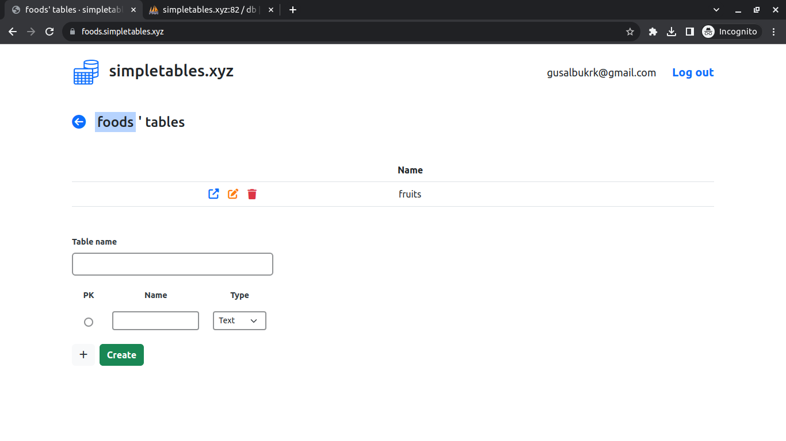
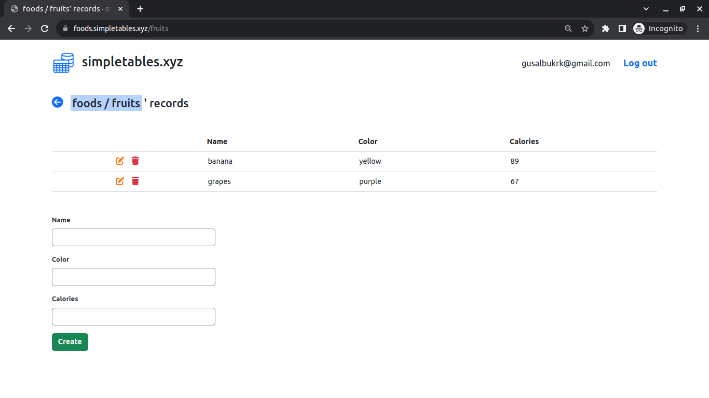
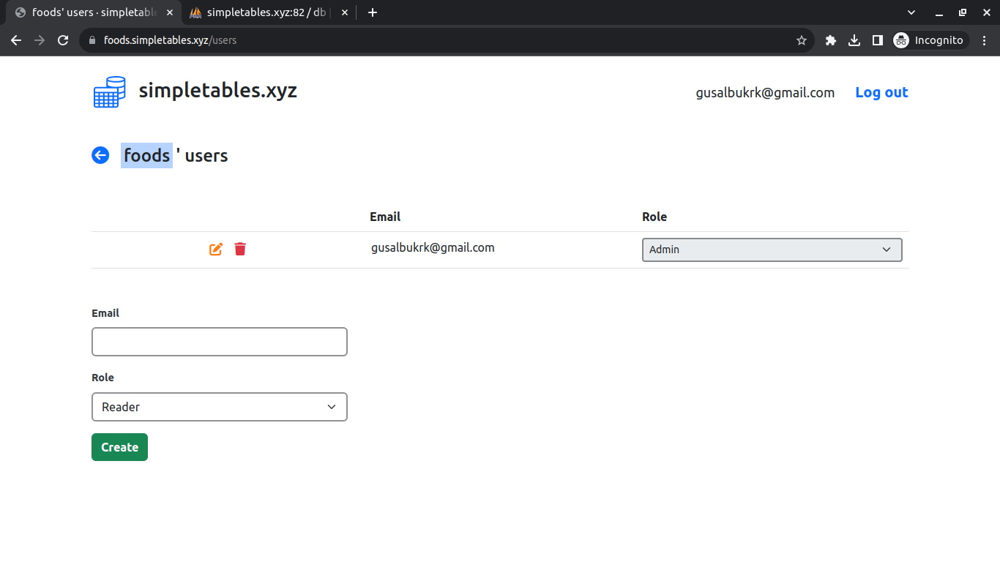

- [simpletables.xyz](#simpletablesxyz)
  - [Overview](#overview)
  - [How to run](#how-to-run)
  - [How to deploy](#how-to-deploy)
    - [Register a domain](#register-a-domain)
    - [Set up hosting](#set-up-hosting)
    - [Initial server configuration](#initial-server-configuration)
    - [Issue Let's Encrypt certificate](#issue-lets-encrypt-certificate)
    - [Set up a free email](#set-up-a-free-email)
    - [Renew certificate](#renew-certificate)

 

# simpletables.xyz

## Overview

**Sign up page**
 

**Log in page**
 

**Reset password page**
 

**Databases page**
 

**Tables page**
 

**Records page**
 

**Database's users page**
 

## How to run

- `./run.sh <password>` = **start** app, `password` argument is to be used as MySQL root user password
  - access phpMyAdmin and import the [database dump](./db.sql)
- `docker compose down` = **stop** app

## How to deploy

### Register a domain

- register a domain on [**Namecheap**](https://www.namecheap.com/)

### Set up hosting

- create an account on [**DigitalOcean**](https://www.digitalocean.com/)
- create a **project** and a **SSH key** on [settings](https://cloud.digitalocean.com/account/security)
- create a **droplet** inside the project created previously and select the SSH key created on the previous step as the authentication method
- change DNS provider from Namecheap to DigitalOcean
  - access the domain config page at Namecheap and change "nameservers" from "Namecheap BasicDNS" to "Custom DNS" and add DigitalOcean's nameservers ([instructions](https://docs.digitalocean.com/tutorials/dns-registrars/))
  - access DigitalOcean, add domain to the droplet and create a wildcard `A record` pointing to `*`
  - NOTE: later you'll revert to use Namecheap but for now using DigitalOcean is necessary to easily issue a SSL certificate

### Initial server configuration

- access the droplet using **SSH** — example: `ssh root@137.184.12.128`
- [create user and give they root privileges](https://www.digitalocean.com/community/tutorials/initial-server-setup-with-ubuntu-22-04)
- [install docker on your server](https://www.digitalocean.com/community/tutorials/how-to-install-and-use-docker-on-ubuntu-22-04)
- [install docker compose on your server](https://www.digitalocean.com/community/tutorials/how-to-install-and-use-docker-compose-on-ubuntu-22-04)

### Issue Let's Encrypt certificate

- [enable **SSL** using Let's Encrpyt](https://www.digitalocean.com/community/tutorials/how-to-acquire-a-let-s-encrypt-certificate-using-dns-validation-with-certbot-dns-digitalocean-on-ubuntu-20-04)
  - NOTE: at section 'Step 3 - Issuing a Certificate', instead of using one of the commands provided as example, use instead ([source](https://certbot-dns-digitalocean.readthedocs.io/en/stable/)): `sudo certbot certonly --dns-digitalocean --dns-digitalocean-credentials ~/certbot-creds.ini -d simpletables.xyz -d '*.simpletables.xyz'` to acquire a **wildcard certificate**
  - NOTE: during step 2 you'll need to create a **DigitalOcean token** ([instructions](https://docs.digitalocean.com/reference/api/create-personal-access-token/))
  - NOTE: DigitalOcean must be the DNS provider because you're using the certbot-dns-digitalocean plugin, if using any other provider you will get the error [**Unable to determine base domain** for simpletables.xyz](https://community.letsencrypt.org/t/unable-to-determine-base-domain-for-using-names-domain-com-com/94306)

### Set up a free email

- until now you used DigitalOcean as the **DNS provider**, however Namecheap offers functionalities DigitalOcean doesn't because of that you'll switch to Namecheap
  - on DigitalOcean, delete domain
  - on Namecheap, remove DigitalOcean's nameservers by choosing 'Namecheap BasicDNS' and adding the following records:
    - type: A record, host: @, value: droplet ip
    - type: A record, host: *, value: droplet ip
- configure Namecheap to **forward emails** sent to a custom domain address (e.g. `admin@simpletables.xyz`) to a regular email (e.g. `simpletables@outlook.com`) — at 'REDIRECT EMAIL' section add the following record ([source](https://www.namecheap.com/support/knowledgebase/article.aspx/308/2214/how-to-set-up-free-email-forwarding/)):
  - alias: admin, forwards to: simpletables@outlook.com
- to be able to **send emails** with your custom domain, you must set up a SMTP server — sign up to [SMTP2GO](https://www.smtp2go.com/) with a custom domain email and follow given instructions
  - in SMTP2GO, SMTP username must be `simpletables` and have the same password as the one passed to [`run.sh`](./run.sh) script.

### Renew certificate

- first, you'll need to **switch back to DigitalOcean from Namecheap** when it's time to renew the SSL certificate otherwise you'll get the error [Unable to determine base domain for simpletables.xyz](https://community.letsencrypt.org/t/unable-to-determine-base-domain-for-using-names-domain-com-com/94306)
  - access the domain config page at Namecheap and change "nameservers" from "Namecheap BasicDNS" to "Custom DNS" and add DigitalOcean's nameservers ([instructions](https://docs.digitalocean.com/tutorials/dns-registrars/)); now on DigitalOcean, add domain to droplet the droplet and create a wildcard `A record` pointing to `*`
- run `sudo certbot renew --dry-run -v` first to check everything will work and then `sudo certbot renew` to actually renew certificates that're near their expiration date
  - if you encounter the error `Error finding domain using the DigitalOcean API: Unable to authenticate you (Did you provide a valid API token?)` it's because the DigitalOcean's personal access token expired and you need to generate a new one and replace it on the file you created at `Issue Let's Encrypt certificate` section (if you followed the instructions precisely, file path is `~/certbot-creds.ini`)
- restart the droplet for the changes to take effect
- when everything is working, you can switch back to Namecheap - check `Set up a free email` section for instructions
